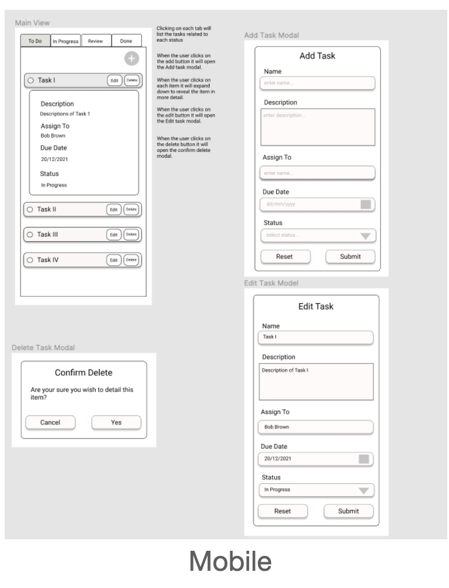
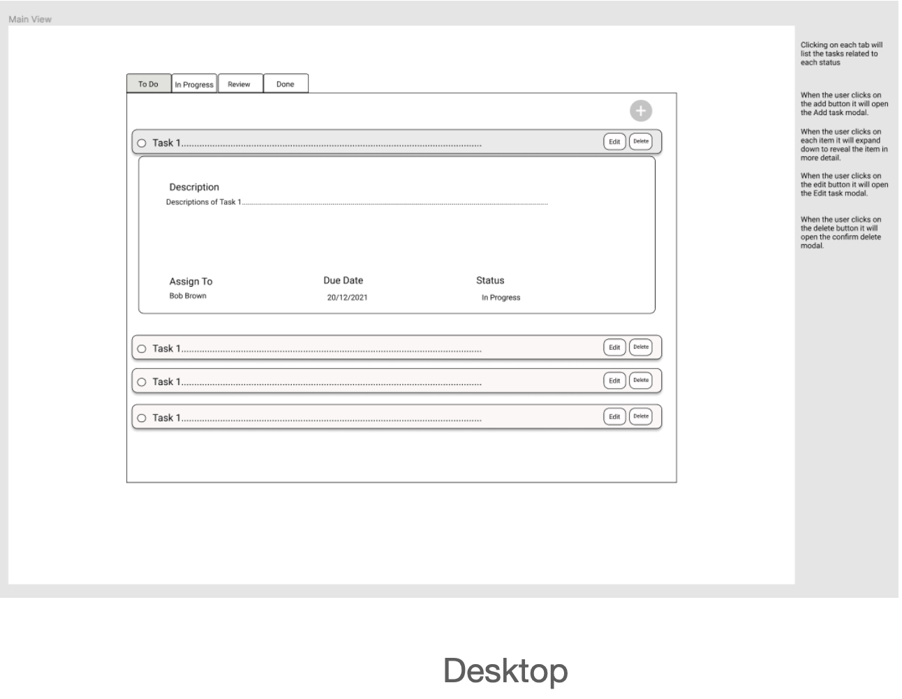
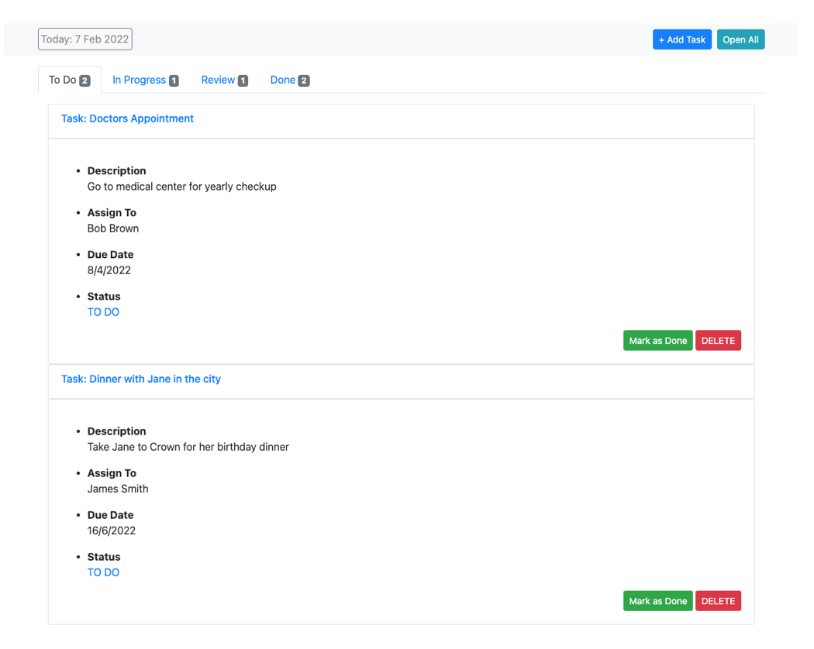

<h1>ToDo Application</h1>

This is a simple to-do task manager built for the Generation Australia JWD final project.
This application utilise many components/classes from the [Bootstrap Library.](https://getbootstrap.com/docs/5.1/getting-started/introduction/)

<h3>Wireframe</h3>
Wireframes were created in [Figma](https://figma.com) to illustrate what the task manager could look like.
Wireframes for both a mobile and desktop version were created to ensure the application is mobile responsive.

  
  

<h3>Design Principles</h3>
The design concept was to go with something that was minimalistic, clean and simple. The focus was on functionality and ease of use for the user.
The colour pallet was also simple with prominent colours used only in call to action areas.

  

<h3>Usage</h3>
<ol>
    <li>Clone the repository.</li>
    <li>Run `index.html` in your code editor or open it in your browser</li>
    <li>Add your first task by clicking the `Add Task` button on the top right.</li>
</ol>

<h3>To do</h3>
<ol>
    <li>Add unit testing.</li>
    <li>Add an edit feature so users can edit a task.</li>
</ol>